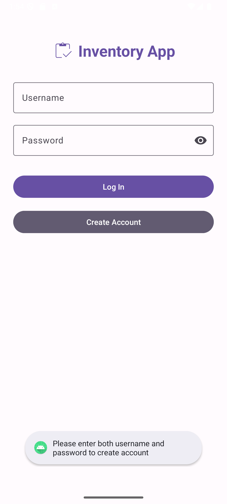
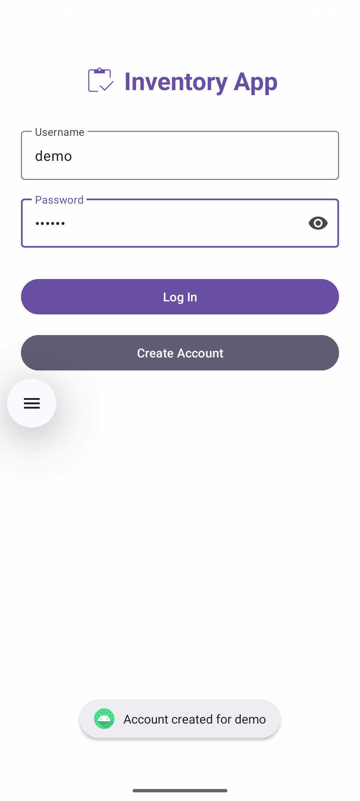
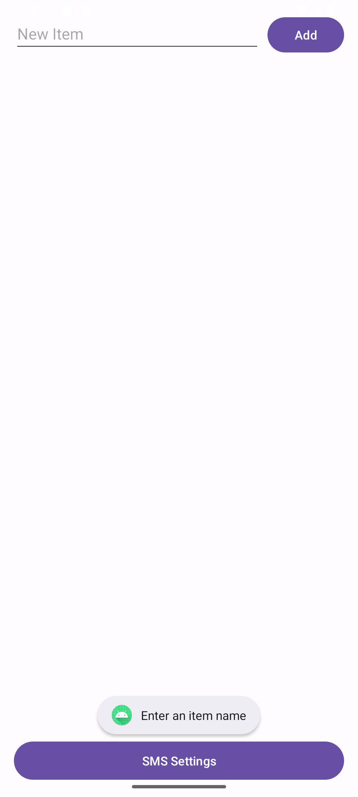
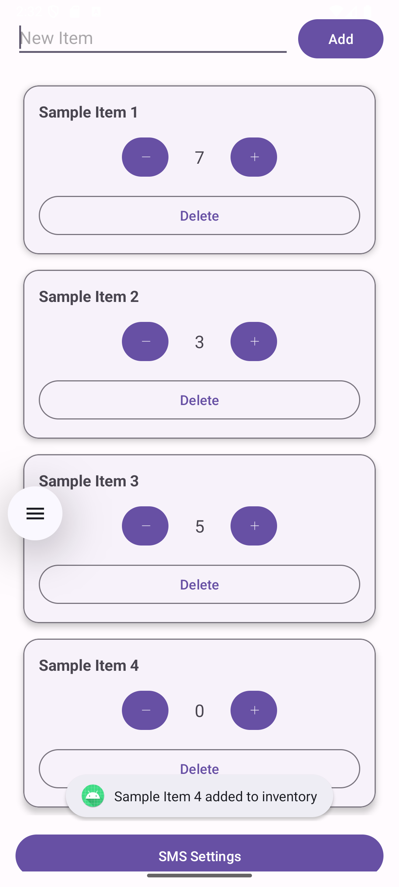
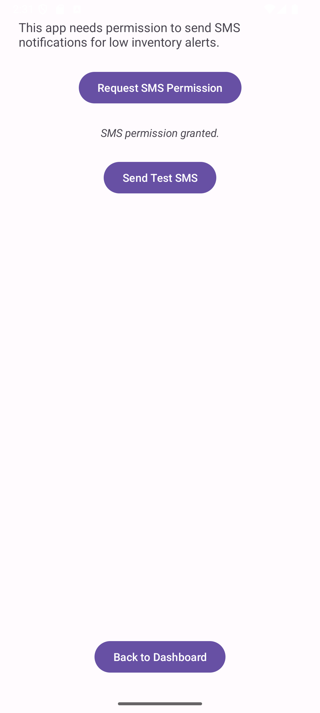
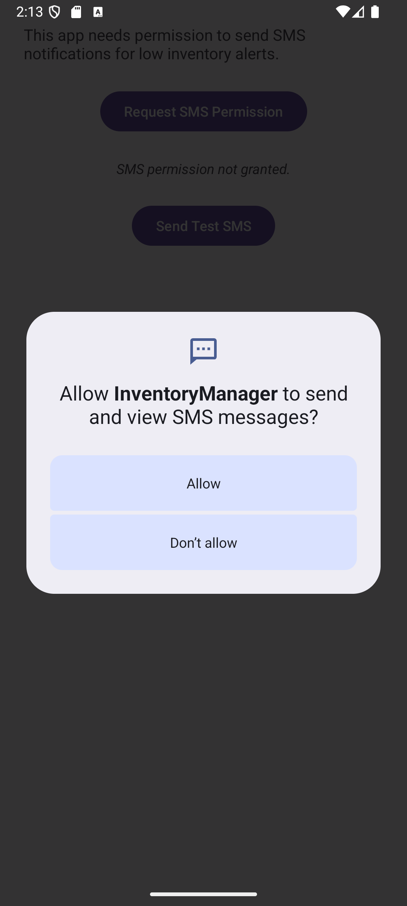
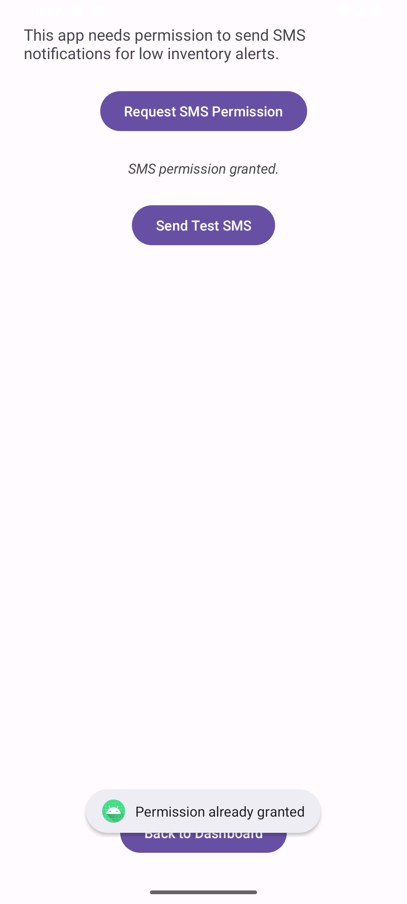
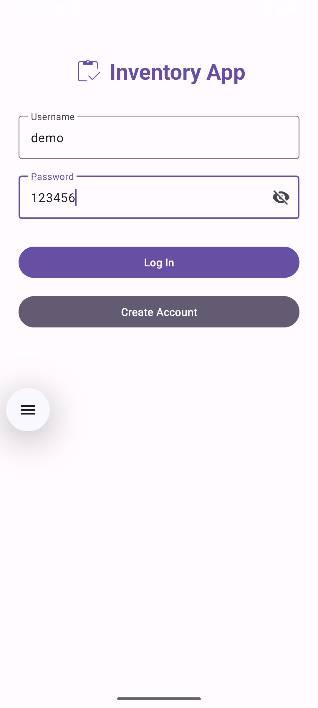
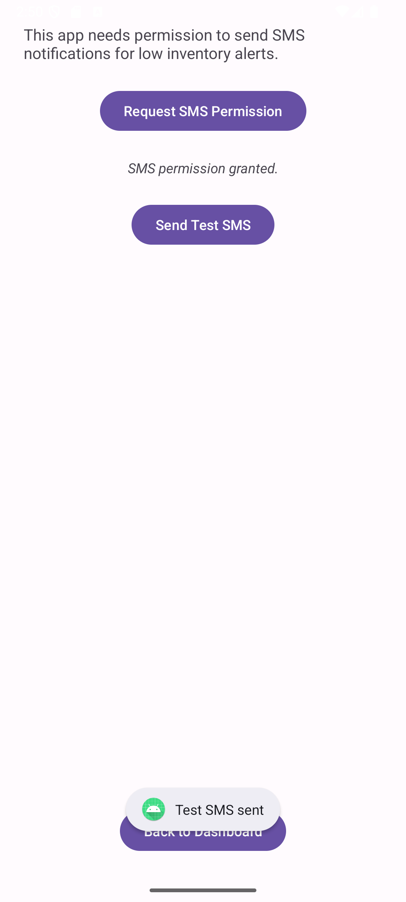

# 📦 InventoryManager – Android App
**CS 360 – Mobile Architecture and Programming**  
**👤 Created by:** Alex Leet

---

## 📝 Project Summary
**InventoryManager** is a lightweight and user-friendly Android app for tracking inventory items. It is ideal for personal and small business use, allowing users to add items, update their quantities, or delete them. It also includes an optional SMS notification feature to alert users when certain inventory thresholds are met. The design is clean and follows Material 3 principles for a modern and accessible experience. 

---

## 💻 Tech Stack

---

## 💭 Reflection

### 🎯 What was the goal of this app?
The app was built to allow users to manage an inventory list from their Android device. The goal was to add an intuitive tool for adding, updating, and deleting items. Additionally, the app allows users to receive SMS alerts about their inventory, providing a helpful notificaton feature.

### 📱 What screens and features were included?
- **Login screen** – For user authentication
- **Create account flow** – For first-time users
- **Dashboard** – A grid-style display of items with buttons to update quantities or delete entries
- **SMS Permission screen** – Allows users to grant permission and send a test SMS

These screens were designed to be simple and functional, focusing on user-centered design. The layout is consistent, with clear labels, helpful hints, and a logical flow.

### 🧑‍💻 How did I build the app?
The app was developed using Java in Android Studio. I used components such as `RecyclerView`, `MaterialButton`, and `TextInputLayout` for UI, and `SQLite` for local data storage. I added runtime permission handling for SMS functionality and structured the code using a clean separation between logic and UI.

### 🧪 How did I test it?
To make sure the app worked correctly and felt smooth to use, I tested it step-by-step on both an Android emulator and a real device. Here's what I checked:

- **Tested login and account creation** using both valid and invalid credentials
- **Verified item management**:
  - Added new inventory items
  - Updated item quantities (increase/decrease)
  - Delete items from the list
- **Checked duplicate entry handling** – confirmed that the app shows a message if the item already exists
- **Tested empty input cases** – made sure the app shows warnings if the input is left blank
- **Tested SMS permission flow**:
  - Permission requested only when needed
  - Verified SMS was sent only if permission was granted
  - Confirmed the app continues to work even if permission is denied

### 💡 Where did I have to get creative?
Getting the **Remember Me** checkbox to work properly presented some challenges. I wanted users to stay logged in if they selected that option, so they wouldn't have to enter their username and password every time. At first, I wasn't sure how to save that login state between sessions.

I eventually figured out how to use **shared preferences** to store the user's login info when the checkbox is checked. Then, when the app starts, it checks if the user chose to be remembered. If they did, it skips the login screen and goes straight to the dashboard.

### 🌟 What part am I most proud of?
I’m most proud of the **dashboard** screen where users can see all their items. It shows the item names and quantities, and the buttons let users update or delete items right away. It felt great to see everything update in real time when I got it working.

---

## 🖼️ App Screenshots

### 🔐 Login Screen  

### 🧾 Create Account  

### 🧺 Empty Dashboard  

### ➕ Item Added  

### 📲 SMS Permission Screen  

### 🔔 Permission Popup  

### ✅ Permission Granted  

### 👁️ Password Toggle  

### 📨 Test SMS Sent  

---

## 🔗 Submission
This app was developed as part of **CS 360 – Mobile Architecture and Programming**. It reflects what I’ve learned about Android app development, including UI design, local storage with SQLite, and runtime permission management.

 

